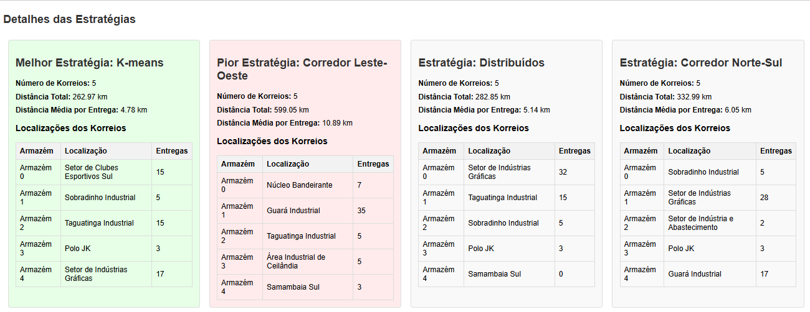
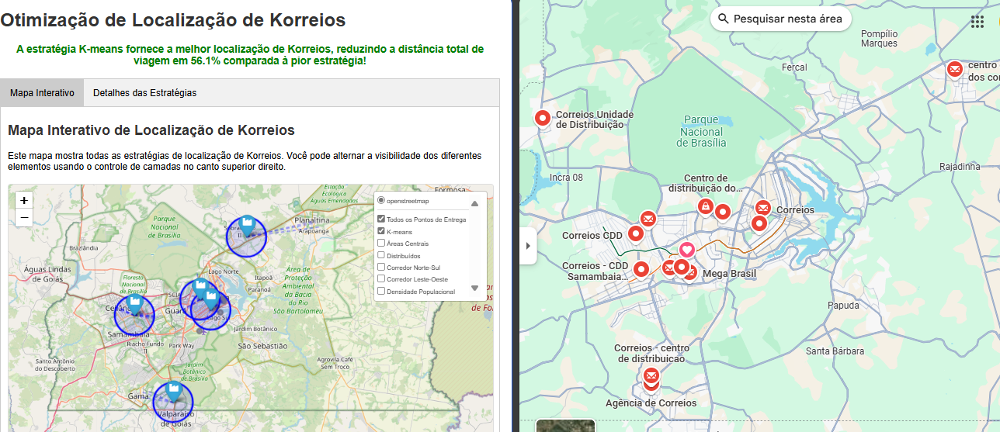

# **Greedy - Otimização de Localização de Korreios** 

**Conteúdo da Disciplina**: Greedy

## Alunos

| Matrícula | Aluno                     |
| --------- | ------------------------- |
| 200056981 | Arthur Ferreira Rodrigues |
| 190084731 | Augusto Duraes Camargo    |

## Link para o Vídeo

[Vídeo no Youtube](https://youtu.be/XXXXXXXXXX)

## Sobre

O projeto consiste em um sistema de otimização de localização de centros de distribuição (Korreios) para uma agência de entregas em Brasília utilizando **algoritmos gananciosos (greedy)** e análise geográfica. O sistema implementa diferentes estratégias de posicionamento de armazéns e utiliza algoritmos de otimização para minimizar as distâncias totais de entrega.

### Implementação de Algoritmos Gananciosos

O projeto aplica uma **solução própria baseada em algoritmos ambiciosos** para resolver o problema de otimização logística:

**1. Atribuição Ótima de Entregas**
- Para cada ponto de entrega, sempre escolhe o armazém mais próximo imediatamente
- Estratégia gananciosa clássica que otimiza localmente sem considerar impacto global
- Complexidade O(n×m) em vez de O(n!) para busca exaustiva

**2. Posicionamento com Restrições Geográficas**
- Quando o K-means encontra centros ótimos matematicamente, o algoritmo escolhe a primeira área industrial mais próxima disponível
- Não explora outras combinações possíveis, tomando decisões irreversíveis
- Aplica restrições geográficas reais de Brasília (16 áreas industriais/comerciais)

**3. Estratégias Heurísticas**
- **Áreas Centrais**: Escolhe as áreas mais centrais
- **Corredor Norte-Sul**: Seleciona uma sequência linear
- **Densidade Populacional**: Prioriza áreas de maior densidade
- Cada estratégia aplica heurísticas simples baseadas em informação local

**4. Greedy Híbrido Inovador**
- Combina K-means (otimização global) com escolhas gananciosas (otimização local)
- Implementa múltiplas heurísticas gananciosas comparáveis em uma única solução
- Evita busca exaustiva de 4.368 combinações possíveis (16!/(5!×11!))

A aplicação permite aos usuários:
- Visualizar mapas interativos com localização de Korreios e pontos de entrega
- Comparar diferentes estratégias de posicionamento de armazéns
- Analisar métricas de desempenho (distância total, média por entrega)
- Explorar rotas de entrega e áreas de cobertura
- Visualizar dados estatísticos sobre a eficiência de cada estratégia

Algoritmos de otimização implementados:
- K-means clustering com restrições geográficas
- Cálculo de distâncias geodésicas usando geopy
- Atribuição por vizinho mais próximo
- Análise comparativa de múltiplas estratégias
- Visualização interativa com Folium

## Screenshots

### Mapa Interativo de Estratégias




## Instalação 

**Linguagem**: Python 3.9+

**Frameworks e Bibliotecas**:
- NumPy (computação científica)
- Matplotlib (visualização de gráficos)
- Scikit-learn (algoritmos de machine learning)
- Folium (mapas interativos)
- Geopy (cálculos geodésicos)

### Pré-requisitos

1. Python 3.9 ou superior
2. Pip (gerenciador de pacotes Python)

### Passos para instalação

1. Clone o repositório:

2. Instale as dependências:
   ```
   pip install -r requirements.txt
   ```

3. Os dados de pontos de entrega já estão incluídos no código com coordenadas reais de Brasília.

## Uso 

1. Execute o sistema de otimização:
   ```
   python supply_chain_optimizer.py
   ```

2. Acesse o arquivo HTML gerado:
   ```
   resultado_localizacao_korreios.html
   ```

3. Navegação na aplicação:
   - **Mapa Interativo**: Permite explorar todas as estratégias de posicionamento
   - **Detalhes das Estratégias**: Mostra métricas detalhadas de cada abordagem

4. Funcionalidades:
   - Clique nas camadas do mapa para alternar a visibilidade de diferentes estratégias
   - Visualize círculos de cobertura de 5km ao redor de cada Korreio
   - Analise as rotas de entrega através das linhas tracejadas
   - Compare métricas de distância total e eficiência entre estratégias
   - Explore as localizações otimizadas em áreas industriais de Brasília

## Outros 

- O sistema utiliza 55 pontos de entrega baseados em locais reais de Brasília, incluindo hospitais, shoppings, universidades e marcos históricos.
- A otimização considera 16 áreas industriais/comerciais adequadas para instalação de centros de distribuição.
- As distâncias são calculadas usando coordenadas geodésicas reais, considerando a curvatura da Terra.
- O algoritmo K-means é aplicado com restrições geográficas para garantir que os armazéns sejam posicionados apenas em áreas adequadas.
- O sistema compara 6 estratégias diferentes: K-means, Áreas Centrais, Distribuídos, Corredor Norte-Sul, Corredor Leste-Oeste e Densidade Populacional.
- A visualização interativa é gerada usando Folium com mapas OpenStreetMap e controles de camadas para análise comparativa.
- Os resultados demonstram que a estratégia K-means oferece a melhor otimização, reduzindo a distância total de viagem em até 56.1% comparada à pior estratégia.